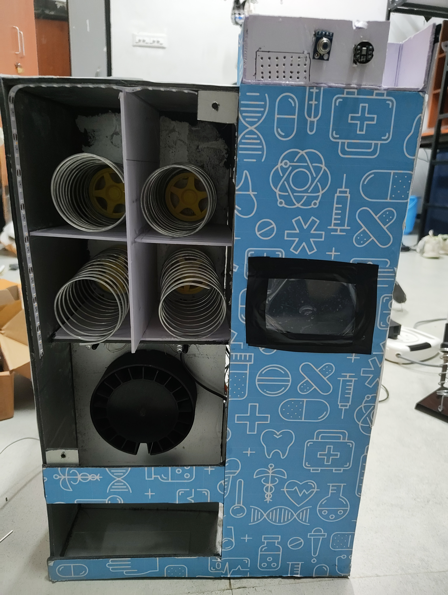

# AI-powered Teleconsultation Triage System
### An AI-powered triage and teleconsultation system that prioritizes patients based on severity using voice input and sensor data, generates structured summaries for doctors, and enables efficient rural healthcare delivery with integrated medicine dispensing.
### HARDWARE + SOFTWARE + AI INTEGRATION

---

<!-- Add your project banner/demo image here -->


---


## 1. HARDWARE

The hardware layer captures patient vitals via IoT sensors and streams them to the backend API over a local WiFi network.

**Sensors used:**
- Heart rate monitor
- Blood pressure sensor
- Temperature sensor (°C)
- SpO₂ (pulse oximeter)
- Respiratory rate sensor

**Microcontroller:** Arduino (C/C++ firmware located in `hardware/`)

Vitals are POSTed to the `/triage` endpoint as JSON. The device and the server must be on the same WiFi network.

---

## 2. SETUP

> **Prerequisites:** Python 3.10+, [Ollama](https://ollama.com), Windows OS (for Chocolatey steps)

### 2.1 Installing Chocolatey

Inside the terminal:
```console
Set-ExecutionPolicy Bypass -Scope Process -Force; [System.Net.ServicePointManager]::SecurityProtocol = [System.Net.ServicePointManager]::SecurityProtocol -bor 3072; iex ((New-Object System.Net.WebClient).DownloadString('https://community.chocolatey.org/install.ps1'))
```

### 2.2 Installing ffmpeg

Inside the terminal:
```console
choco install ffmpeg
```

### 2.3 Setting up Python virtual environment

Inside the terminal:
```console
cd <project_directory>
python -m venv venv
venv\Scripts\activate
pip install -r requirements.txt
```

### 2.4 Launching the API

Inside the terminal:
```console
uvicorn api:app --host 0.0.0.0 --port 8000 --reload
```

The API will be accessible on your local network at `http://<your-ip>:8000`.
Swagger docs available at `http://<your-ip>:8000/docs`.

> **Find your local IP:**
> ```console
> ipconfig
> ```
> Look for the IPv4 address under your active WiFi adapter.

---

## 3. AI INTEGRATION

### 3.1 Pulling the models

Inside the terminal:
```console
ollama pull phi3
ollama pull qwen2.5:7b
```

### 3.2 Setting up OpenAI Whisper

Inside the terminal:
```console
pip install openai-whisper
```

### 3.3 Pipeline — execution of AI models one after another

```
Patient Audio + Vitals (IoT)
        │
        ▼
┌──────────────┐
│  speech.py   │  ← Whisper (transcription + translation to English)
└──────┬───────┘
       │ transcript.txt
       ▼
┌─────────────────────────────────┐
│  structured_report_and_queue.py │  ← qwen2.5:7b via Ollama
└──────┬──────────────────────────┘
       │ report<n>.json  (triage priority, patient summary, diagnosis)
       ▼
┌──────────────────────┐
│  recommendation_model│  ← phi3 via Ollama
└──────┬───────────────┘
       │ recommendations.json  (matched medicines from medicines.json)
       ▼
┌──────────┐
│  tts.py  │  ← pyttsx3 (offline text-to-speech → patient_summary.wav)
└──────────┘
```

**Step 1:** Audio of the patient goes into the `speech.py` module which transcribes and translates the audio to English, returning a `transcript.txt` file.

**Step 2:** The `transcript.txt`, `vitals.json`, and `medicines.json` go into the `structured_report_and_queue.py` module which produces a structured medical triage report as `report<number>.json`.

**Step 3:** The `transcript.txt`, `vitals.json`, and `medicines.json` go into the `recommendation_model.py` module to produce a list of recommended medicines as `recommendations.json`.

**Step 4:** The patient summary from the report is passed into `tts.py` which generates an audio summary saved as `static/patient_summary.wav` and served at `/static/patient_summary.wav`.

---

## 4. WEBSITE

Live dashboard: [medxaii.vercel.app](https://medxaii.vercel.app)

The frontend is a React dashboard located in `frontend/`. It connects to the FastAPI backend and provides:

- **Patient queue** — lists patients with colour-coded triage priority (critical / high / medium / low)
- **Vitals input** — form pre-filled with sensor defaults, submits to `/triage`
- **Triage report** — displays AI-generated priority, diagnosis, and patient summary
- **Audio summary** — embedded WAV player streaming from `/static/patient_summary.wav`
- **Medicine recommendations** — lists matched medicines with dosage and stock status

### Running the frontend locally

```console
cd frontend
npm install
npm run dev
```

Update the API base URL in the dashboard to point to your server:
```js
const API_BASE = "http://<your-ip>:8000";
```

---

## 5. API REFERENCE

Base URL: `http://<your-ip>:8000`

| Method | Endpoint  | Description                        |
|--------|-----------|------------------------------------|
| GET    | `/health` | Liveness probe — returns `{"status": "ok"}` |
| POST   | `/triage` | Full triage pipeline — accepts vitals JSON, returns transcript, report, recommendations, and WAV URL |
| GET    | `/static/patient_summary.wav` | Stream the latest TTS audio summary |
| GET    | `/docs`   | Interactive Swagger UI             |

**Example request:**
```json
POST /triage
{
  "vitals": {
    "heart_rate": 95,
    "blood_pressure": "120/80",
    "temperature": 37.5,
    "spo2": 97,
    "respiratory_rate": 18
  }
}
```

**Example response:**
```json
{
  "transcript": "Patient reports headache and mild fever for two days...",
  "report": {
    "triage_priority": "medium",
    "patient_summary": "...",
    "diagnosis": "..."
  },
  "recommendations": {
    "recommendations": [...]
  },
  "tts_audio_path": "/absolute/path/static/patient_summary.wav",
  "tts_audio_url": "http://192.168.1.x:8000/static/patient_summary.wav"
}
```

---

## 6. TECH STACK

| Layer       | Technology                          |
|-------------|-------------------------------------|
| Hardware    | Arduino, C/C++                      |
| Backend     | FastAPI, Python                     |
| Speech      | OpenAI Whisper                      |
| AI Models   | Ollama — qwen2.5:7b, phi3           |
| TTS         | pyttsx3 (offline WAV)               |
| Frontend    | React, deployed on Vercel           |
| Audio       | FastAPI StaticFiles (`/static/`)    |